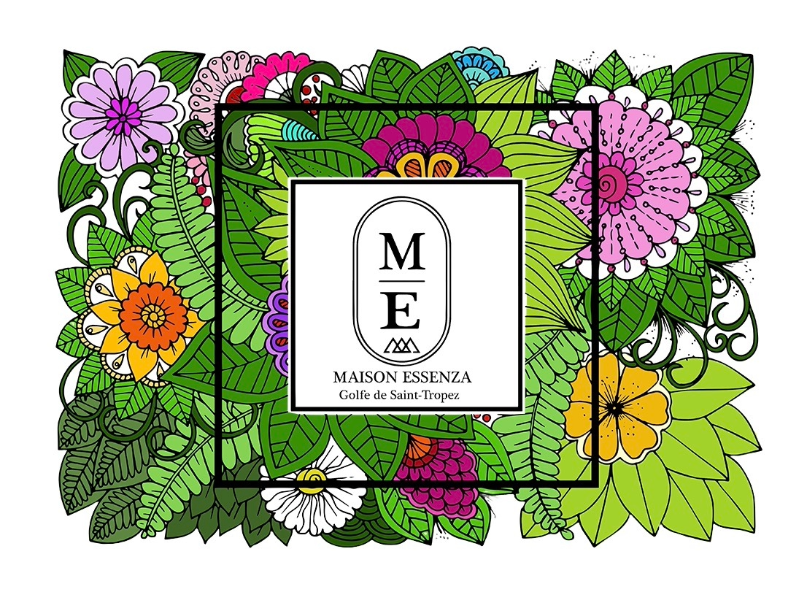

## Welcome to MAISON ESSENZA 🌸

## MAISON ESSENZA 🌸

> A modern showcase site project built with **Next.js 14**

---

### 🏠 **Description**

**MAISON ESSENZA** is a professional showcase website dedicated to the world of design furniture.

---

### ✨ **Key Features**

- Responsive and performant user interface built with **Next.js 14**.

---

### 🛠️ Technologies Used

- **Frontend** :

  - [Next.js 14](https://nextjs.org/) : A modern React framework.
  - [Framer Motion](https://www.framer.com/motion/) : For smooth and interactive 2D animations.

- **Styling** : SCSS.

---

### 📊 Project Progress

The project is functional, but it will continue to evolve over time with regular improvements and the addition of new features to provide an ever-optimizing user experience.
